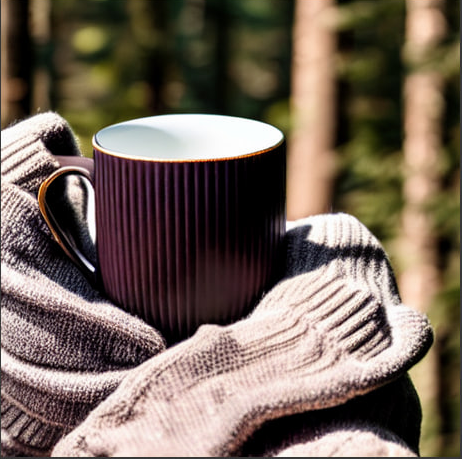
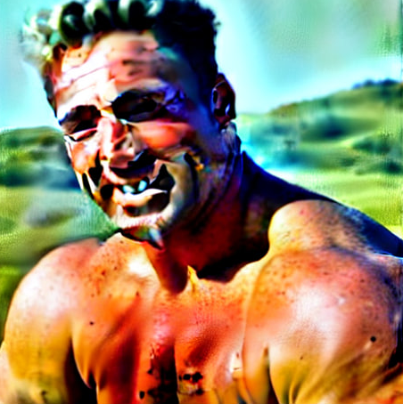
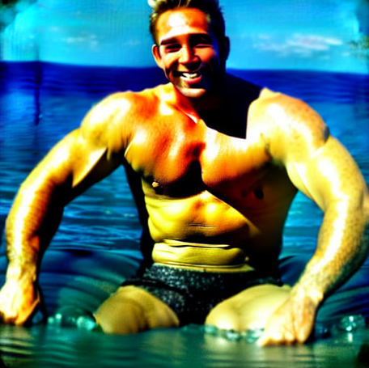
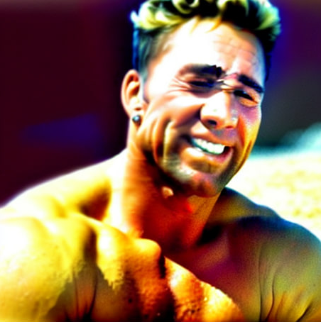
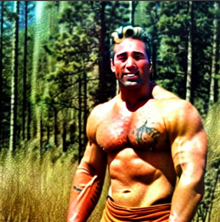
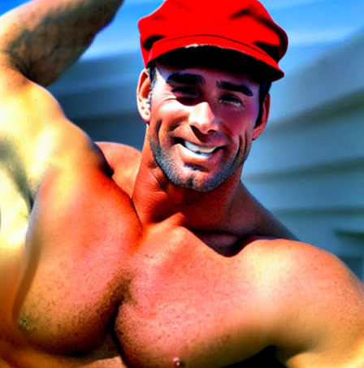
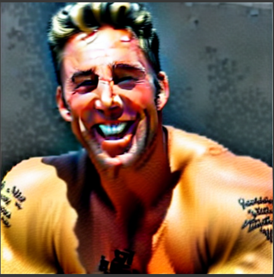
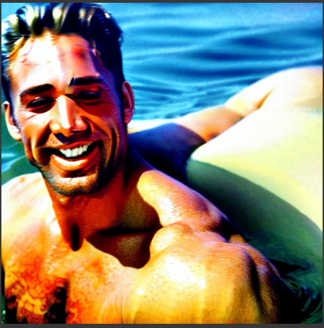
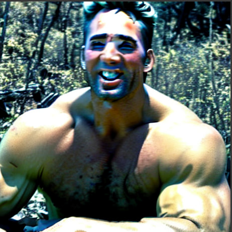
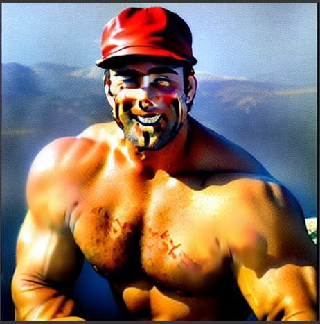

# Dreamboth

## 1. Проблематика

1. Даннаю задачу обозначают как "персонализация". Как нам сделать так, чтобы модель запомнила наш конкретный объект и могла бы воспроизводить его
в различных контекстах, которые мы захотели бы или просто дополнять наше изображение некоторыми характеристиками которые мы укажем в тексте?

2. Предположим, что мы хотим отрисовывать какой-либо объект при помощи text2image моделей в каких-то определенных локациях, в которых этот объект не был представлен. Например, вашего любимого кота на вершине Эвереста. Или, допустим, у вас есть площадка, где малый бизнес размещает свои товары, к которым этот малый бизнес делает карточки с изображениями, фотографиями продукции, но эти карточки не настолько выразительны, как хотелось бы, что отражается на доходах. Представьте теперь, что вы хотите улучшить конверсию используя какие-нибудь механизмы для улучшения карточек товаров. Как можно сделать это просто и дешево? - Именно. Использовать генеративные модели для повышения качества изображений, но при этом вам будет важно сохранять исходный объект в целости и сохранности, без каких-либо изменений. Для этого вам помогут подходы решающие задачу "персонализации".

3. Задачу можно сформулировать более формально следующим образом.

```
Пусть у нас есть некоторое количество изображений какого-либо объекта. И пусть у нас есть некоторая модель, которая умеет генерировать изображения. Как используя имеющийся датасет с объектом, имплементировать этот объект в домен, с которым уже может работать выбраннная модель, (то есть такое множество изображений, которое нейросеть умеет генерировать), чтобы иметь возможность генерировать имеющийся объект в различных контекстах выходного домена.
```

## 2. Почему Dreamboth?

*Dreamboth* предполагает решение основанное на связывании некоторого токена с объектом, который мы хотим отображать. Предполагается, что данный токен будет выступать уникальным идентификатором объекта, и в моменты, когда бы будем использовать данный токен в промптах, модель будет понимать, что мы хотим отобразить тот объект, который к этому токену привязан.

Для дообучении модели используя заранее предподготовленный датасет
с изображенными объектами.

### 2.2 В чем уникальность?

Самая близкая статья [An Image is Worth One Word: Personalizing Text-to-Image Generation using Textual Inversion](https://arxiv.org/pdf/2208.01618.pdf) от исследователей из NVIDIA, которые пытается использовать похожий механизм "скрепления" токена и изображения.
Основное отличие их подхода от подхода **Dreamboth** заключается в том, что происходит поиск подходящего токена в латентном пространстве, который наиболее близкий к изображениям на которых располагается наш объект. То есть привязка идёт не на прямую через промпт, который мы создаём.
Уникальное отличие от того подхода заключается в том, что тут напрямую строится промпт и выбирается токен, к которому будет привязан наш объект.
Более подробно указано в пункте **2.2.1 Тонкости дообучения**

### 2.2.1 Тонкости дообучения
#### 2.2.1.1 Датасет.
В статье указано, что достаточно 3-5 изображений, которые нужно подавать с некоторым заранее определенным промптом, который должен иметь подобный вид **"A [V} class_object"** (он будет одинаковым для всех изображений). 

#### 2.2.1.2 Промпт
Давайте разберемся, из чего должен состоять промпт.
В данной строчке должен содержаться уникальный идентификатор объекта, по которому наша модель будет определять
что нужно будет генерировать именно наш объект. При этом, выбор идентификатора не должен быть совсем произвольный.

|Идентификатор|Результат| Почему?|
|---|---|---|
|Обычное слово языка|Плохо|Исследователи пишут, что в таком случае модель учится хуже из-за того, что ей нужно, вроде как, выполнить перепривязку смысла от предыдущего объектаи привязаться к новому|
|Cлучайный набор символов|Даже хуже чем *обычное слово*|Предполагается, что например, случайный текст может быть разбит на токены по символам и привязка к такому тексту будет сложнее| 
|Выбирать наименее популярные токены, которые используются токенизатором для нашей модели| Работает хорошо

#### 2.2.2 Preservation
Также, исследователи заметели, что если дообучать модель, то она будет обладать проблемами language drift, reduce output diversity. Для того, чтобы это избежать, разработчики используют трюк, который называется **Prior preservation**. Суть в том, чтобы дообучать модель на генерирование объектов того класса, к которому принадлежит персонализируеммый объект.
То есть, во время обучения мы должны подавать пары следующего вида ("A class_name", изображения объекта class_name). Откуда нам взять такие пары?
Можем просто зафиксировать некоторую исходную модель и генерировать такие пары замороженной моделью, и подавать на дообучаемую модель.
Для этих пар используется **Class specific Preservation Loss**.

#### 2.2.3 Hyperparams

|Parameter| Value|
|-|-|
|Количество примеров объекта| 3-5|
|learning rate|1e-5|
|Iterations|~1000|
|Количество примеров для preservation| ~1000|
|$\lambda$ (Preservation loss weights)| 1|


### 2.3. Результаты.

Данный подход тестировался на нескольких моделях, используя метрики *DINO*, *CLIP-I*, *CLIP-T*. А именно на *Imagen*, *Stable Diffusion*. И модели показали близкие метрики к Real Images.

Также помимо данных метрик, качество *Dreamboth Stable Diffusion* оценивалось пользователями. А именно, сравнивались модели
*Textual Inversion Stable Diffusion* и *Dreamboth Stable Diffusion* по качеству генерируемых изображений (72 пользователя, 25 вопросов для каждого).
Итог был такой, что *Dreamboth Stable Diffusion* предпочитали больше и было замечено, что он лучше сохраняет идентичность объекта.

#### Оставшиеся проблемы

1. Например, если в выходном домене было мало определенного рода контекста
то выбранный субъект будет плохо генерироваться в данных контекстах;
2. Переобучение под определенный конекст, в котором находился персонализируемый объект. Суть в том, что если мы захотим сгенерировать персонализируемый объект
в том контексте, в котором он подовался во время fine-tuning, то мы не будем видить нового такого же контекста;
3. Также модель может галюцинировать и докидывать мелкие детали объекту, который он не содержал изначально.


## Эксперементы
Ноутбук с экспериентами располагается по данной ссылке [](https://colab.research.google.com/drive/1dtRvjE6-v60yCWIr9c7tMzjPUlSaxio7?usp=sharing)

Для того, чтобы запустить результаты эксперимента выполните следующие шаги:

1. Запустите 1-ю ячейку из вышеуказанного ноутбука;
2. В имеющуюся папку поместите изображения из директорий, которые находятся в папке **data**;
3. Далее в папку **content/output/** поместите веса, располагающиеся в одной из директорий папки **weights**;
4. После чего можно запустить ячейки после заголовка **INFERENCE**.

Для начала, я пытался попробовать поэксперементировать с дообучением на генерирование [конкретной кружки](data/cup/).
После недолгой игры с гиперпараметрами (увеличил LoRA до 64 и при запуске с Guidance=15) полуились следующие результаты:

<figure>  
<figcaption>"A asks cup in the forest" and "A sks cup on the table"</figcaption>
</figure> 

После чего решил использовать ля экспериментов использовались картинки актёра Билли Хэррингтона, которые располагаются в данной [папке](data/actor/)

Изначально были изменены параметры LoRA. А именно взят ранг побольше. Было предположение, что человек более сложная структура, чем какой-нибудь чайник, поэтому хотелось увеличить параметры.

В таблице ниже представлены результаты некоторых экспериментов, которые были проведены. Как можно заметить, модель действительно может воспроизводить нужный объект, но замечаются некоторые проблемы:
1. Иногда лицо не сохраняется и генерируется с некоторым шумом;
2. Галлюцинирование. Модель добавляет татуировки, которых нет;

Также варьирование параметров LORA_SCALE приводит к тому, что сохраняются некоторые параметры исходного объекта, но он становится более мультяшным и теряются некоторые локальные характеристики, которые хотелось бы сохранять. Но при этом пропадают проблемы связанные с шумами на лице

|LoRA|Epochs|Guidance|LORA_SCALE_UNET|LORA_SCALE_TEXT_ENCODER|FP16| Сгенерированные изображения|Prompts|
|-|-|-|-|-|-|-|-|
|64|1000|15|1|1|+||A sks actor, A sks actor in the sea, A sks actor, A sks actor in the forest, A sks actor in red hat|
|128|1000|15|1|1|+||A sks actor, A sks actor in the sea, A sks actor in the forest, A sks actor in red hat|
|128|1000|15|0.5|0.5|+||A sks actor, A sks actor in the sea, A sks actor in the forest, A sks actor in red hat|


Еще немного сгенерированных изображений с параметрами из первой строки в таблице:
<figure>

<figcaption>A sks actor</figcaption>
</figure>
<figure>

<figcaption>A sks actor with cup of tea</figcaption>
</figure>
<figure> 
<figcaption>A sks actor with cup of tea on the beach</figcaption>
</figure>
<figure>

<figcaption>A sks actor on the bike</figcaption>
</figure>
<figure>

<figcaption>A sks actor with the friends</figcaption>
</figure>